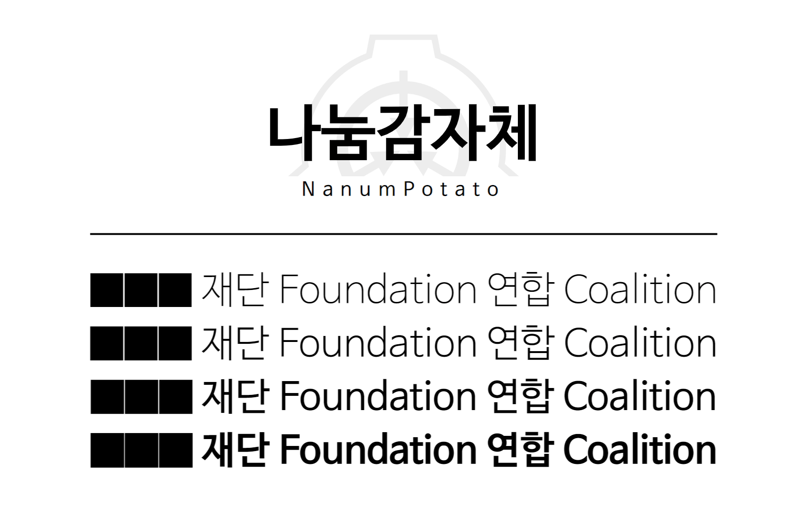

# 나눔감자체



나눔감자체<sub>NanumPotato</sub>는 [SCP 재단 한국어 위키](http://ko.scp-wiki.net)를 위해 만들어진 글꼴입니다.

나눔감자체는 네이버의 [나눔바른고딕](https://hangeul.naver.com/font)에서 유니코드 U+2588에 할당된 Full block을 가득 찬 모양으로 바꿈으로써 탄생했습니다.

## 다운로드
[최신 버전 다운로드](https://github.com/denevola/nanumpotato/releases/latest)

## 웹 폰트
```css
@import url('https://cdn.jsdelivr.net/gh/denevola/nanumpotato/dist/web/nanumpotato-dynamic-subset.min.css');
```

## 라이선스
나눔감자체는 [SIL Open Font License 1.1](https://scripts.sil.org/OFL)로 배포되며, 다른 소프트웨어와 번들하거나 재배포 또는 판매가 가능하고 자유롭게 수정, 재배포하실 수 있습니다.